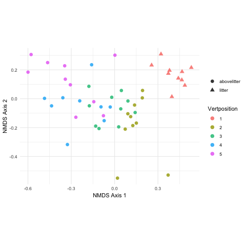
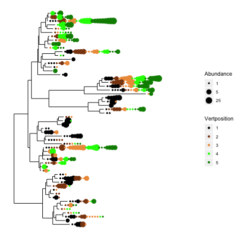

# Speeding up Science Metabarcoding

This repository contains code for several visualizations of amplicon sequencing data.

All the code can be executed by clicking on the binder link. You can also upload your own data to binder, so you use our code for yourself, without installing any of the needed software. All you need is a web browser. Note that any changes you make will not be saved, so if you want to keep anything, so be sure to download any changes you make.

RStudio: [](http://mybinder.org/v2/gh/devonorourke/sus19mb/Niel?urlpath=rstudio)


Most of these visualizations are presented as R scripts, so when you open the binder, it will look like RStudio. The script you want can be opened from the files tab in the lower right of RStudio.

## Interactive NMDS




Draw an NMDS plot that gives you sample names on mouseover. Also allows zooming.

```interactive_nmds.Rmd```


## Interactive Tree



See the taxonomic classification of the leaf on mouse over.

```interactive_tree.Rmd```
